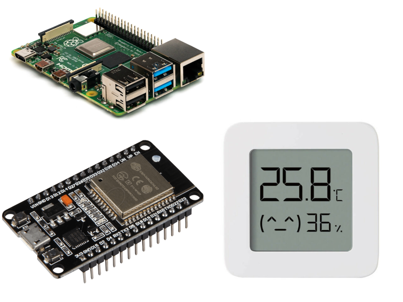
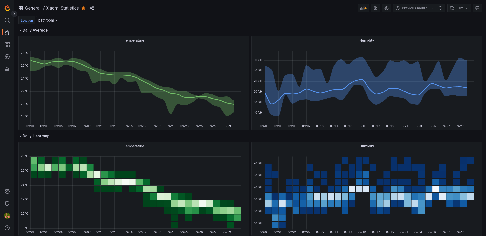

# Xiaomi-temp-humidity-monitor

Setup temperature and humidity monitoring with permanent storage.

## Hardware

* Xiaomi Mi Temperature and Humidity Monitor 2 (LYWSD03MMC and others)
* ESP32 NODEMCU Module WiFi Development Board
* Raspberry Pi (recommended at least Pi 3 with 64 bit version of Raspberry Pi OS) or any other SBC such as Hardkernel Odroid C2/C4

## Software

* ESP32 board flashed with ESPHome 
* Mosquitto MQTT broker
* Node-RED visual programming tool
* PostgreSQL with TimescaleDB and pg_cron extensions
* Grafana dashboard visualisation
* Optional: Home Assistant or OpenHAB home automation systems

## Documentation

Installation instructions are on the [wiki](https://github.com/ahpohl/Xiaomi-temp-humidity-monitor/wiki).
